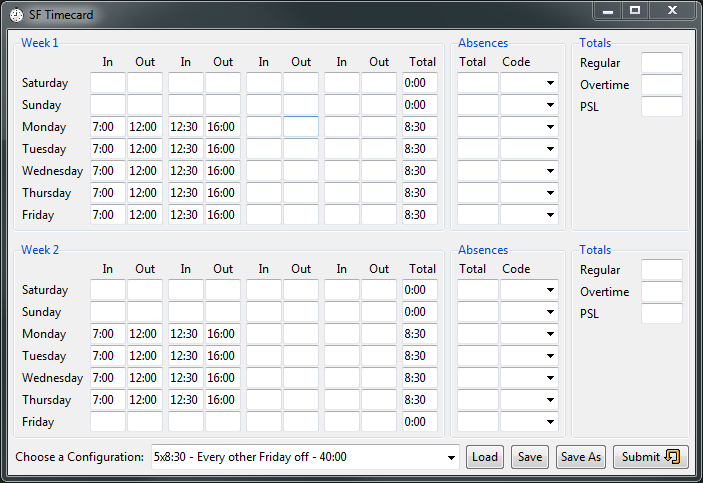

# Timecard

This program aims to save time by allowing the user to enter pre-configured work schedules into a online based time card system. This program aims to save time for those who must use old payroll systems. The math may or may not be accurate so use at your own discretion. I take no responsibility for incorrect math on your timecard. I originally put this app together in my spare time to better learn Python, Tkinter, and GUI design and using selenium and python.

#### Features
- [X] Enters time into your timecard automatically using Selenium WebDriver
- [X] Loads pre-configured hours from a configuration.json file.
- [X] Sum daily, week-regular, and week-overtime hours on load.
- [ ] Save custom working hours back to configuration.json
- [ ] Sum paid sick leave
- [ ] Sum daily, week-regular, and week-overtime hours *after editing* a time entry box.
- [ ] Automatically sum working hours.
- [ ] Entry validation to check if time follows the "HH:MM" pattern to cut down on odd errors.

#### Install
This app has been setup to use cx_Freeze in order to create cross platform installers.

To create a executable version, navigate to the directory where the files are and run the following commands:

- `python setup.py build` (Windows .exe code)
- `python setup.py bdist_msi` (Windows .msi installer)
- `python setup.py bdist_dmg` (Macintosh .dmg installer)

#### Command line
If that does not work, or you for some reason want to run this from the command line, the program can be run by navigating via command line to the folder where the app.py file is located, and running the command `python app.py`. NOTE: You will need to have have python 3.x and + dependent modules like selenium installed locally for this to work.
